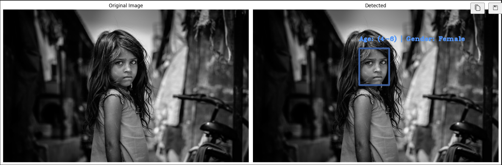

# Age and Gender Detection

## Overview

This project implements real-time age and gender detection using deep learning models and OpenCV’s DNN module. It supports live webcam feeds, pre-recorded video files, and static image inputs. Key goals include:

* Demonstrating how to load and run pre-trained Caffe models for face detection, age classification, and gender recognition.
* Visualizing performance metrics (FPS) directly on video frames or images.
* Providing a modular, easy-to-follow pipeline for data capture, preprocessing, inference, and display.

## Key Features

* `Face Detection`: Uses OpenCV’s DNN face detector (based on a Caffe model) to locate faces in frames.
* `Age & Gender Classification`: Runs separate Caffe-based age and gender networks on detected face regions.
* `Multi-Source Input`: Supports live webcam feed, video files, and batches of static images.
* `Performance Monitoring`: Computes and overlays real-time FPS on each frame.
* `Modular Design`: Clear separation of functionality into reusable functions and sections.

## Requirements

* `Python`: 3.6 or newer
* `Libraries`:

  * `opencv-python` (for video I/O, image processing, and DNN inference)
  * `numpy` (numerical operations)
  * `matplotlib` (displaying images in notebooks)
  * `IPython` (rich display utilities in Jupyter)
* `Model Files` (placed in `models/`):

  * `opencv_face_detector_uint8.pb` & `opencv_face_detector.pbtxt` (face detection)
  * `age_net.caffemodel` & `age_deploy.prototxt` (age classification)
  * `gender_net.caffemodel` & `gender_deploy.prototxt` (gender classification)

## Notebook Sections

1. `Requirements`
   Lists all software dependencies and model files: versions of Python and libraries (OpenCV, NumPy, Matplotlib, IPython), plus pre-trained Caffe model files (prototxt and caffemodel) and directory structure expectations.

2. `Camera Test`

   * `Function`: `visualize_fps(image, fps)` overlays the current frames-per-second count onto a given image or frame with adaptive text coloring.
   * `Script`: Initializes a webcam feed (`cv2.VideoCapture`), captures and resizes frames, computes instantaneous FPS from timestamps, and displays live video with FPS overlay.
   * `Error Handling`: Catches exceptions to safely release camera resources and close OpenCV windows.

3. `Loading Video`

   * `Purpose`: Demonstrates reading a pre-recorded video file (`Einstein_2.mp4`) instead of the webcam.
   * `Frame Rate Control`: Implements timing logic to match a target frame rate (30 FPS), using `time.sleep()` to delay frames when processing is faster than the desired interval.
   * `Display`: Resizes frames, calculates real-time FPS, overlays it, and handles user exit with the ‘Esc’ key.

4. `Loading Models`

   * `Model Paths`: Assembles file paths for face detector and age/gender classification networks using `os.path.join`.
   * `Preprocessing Constants`: Defines `MODEL_MEAN_VALUES` for mean subtraction and lists of age ranges and gender labels.
   * `Network Loading`: Uses `cv2.dnn.readNet()` to load each Caffe model and configuration into memory, preparing them for inference.

5. `Detect Age and Gender in a Frame`

   * ``highlightFace(net, frame, conf_threshold)``: Converts an image to a blob, runs face detection, filters detections by confidence threshold, and draws bounding boxes on detected faces.
   * ``detect_face_age_gender(frame, padding)``: For each detected face, crops with padding, builds a 227×227 blob with mean subtraction, runs gender and age networks, selects highest-probability labels, and overlays “Age: X | Gender: Y” text on the frame.

6. `Age and Gender Detection on Image`

   * `Batch Processing`: Iterates over a set of example images (`kid.jpg`, `girl.jpg`, `man.jpg`, `minion.jpg`) from the `images/` directory.
   * `Color Conversion`: Converts OpenCV’s BGR to RGB for correct Matplotlib display.
   * `Visualization`: Uses Matplotlib subplots to render original vs. annotated frames side by side with titles and no axes for clarity.

7. `Age Detection Using Webcam`

   * `Interactive Notebook`: Leverages `IPython.display` functions (`display()`, `clear_output()`) to update frames inline within a Jupyter cell rather than opening an external window.
   * `Pipeline`: Reads webcam frames, applies `detect_face_age_gender()`, encodes frames to JPEG, and streams them in the notebook with live FPS overlays.
   * `Control Flow`: Listens for the ‘Esc’ key to exit and ensures camera and window resources are released in the `finally` block.

8. `Age and Gender Detection Using Video`

   * `Notebook Mode`: Similar to the webcam detection section but sources frames from a video file (`Jobs_2.mp4`) and displays results inline.
   * `Timing Logic`: Maintains consistent playback speed matching the original video’s frame rate, recalculating sleep intervals dynamically.
   * `Resource Cleanup`: Wraps capture loop in try-except-finally to handle end-of-file and errors gracefully, closing windows and releasing the video stream.

## Results

The results of this test are shown bellow:

    
Image Rendering

    

    
Video Rendering

    

