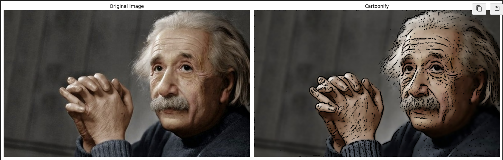
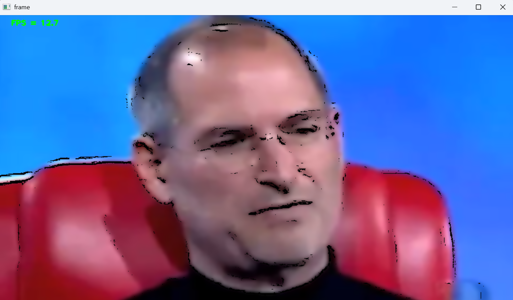

# Cartoonifying Images and Videos

## Overview

This project provides a pipeline to transform images and video streams into a cartoon-like style using classic computer vision techniques. By combining edge detection and color smoothing, it produces visually appealing, stylized outputs in real time for static images, webcam feeds, and video files.

## Key Features

* `Cartoonify Function`: Converts any input image into a cartoon style using grayscale edge masks and bilateral filtering.
* `Static Image Processing`: Batch-process multiple images, displaying original vs. cartoonified results side by side.
* `Real-Time Webcam Cartoonification`: Captures live webcam video, applies the cartoon effect on each frame, and displays the stream inline in Jupyter notebooks with FPS monitoring.
* `Video File Cartoonification`: Reads and processes video files frame by frame, synchronizing to a target frame rate and rendering animated results.
* `Performance Monitoring`: Computes and overlays instantaneous FPS on each frame for stream modes.

## Requirements

* `Python`: 3.6 or newer
* `Libraries`:

  * `opencv-python` (image/video I/O, processing, DNN if needed)
  * `numpy` (numerical operations)
  * `matplotlib` (visualization in notebooks)
  * `IPython` (inline display utilities)

## Code Structure & Section Descriptions

### 1. Imports & Setup

The script begins by importing essential libraries:

* `cv2`: OpenCV for image and video I/O, processing filters, and real-time capture.
* `numpy`: Numerical operations and array manipulation.
* `matplotlib.pyplot`: Display static images in notebooks using plotting utilities.
* `time`: Timestamps and sleep intervals for FPS calculation and frame rate control.
* `sys` & `os`: Operating system interactions, such as file path construction and command-line argument handling.
* `IPython.display`: `display()`, `Image()`, and `clear_output()` functions for inline rendering of video frames in Jupyter notebooks.

Following imports, constants are defined:

* `Frame Dimensions` (`IMAGE_WIDTH`, `IMAGE_HEIGHT`): Target resolution for resizing frames to ensure consistent processing speed.
* `Device IDs and Paths` (`CAMERA_DEVICE_ID`, `video_path`): Camera index or filesystem paths to video files.
* `FPS Control` (`fps`, `FRAME_RATE`, `DURATION`): Variables for measuring and synchronizing playback speed.

This setup centralizes all configuration, making it easy to modify input sources and performance parameters in one place.

### 2. Cartoonify Function

```python
def cartoonify(image):
    if image is None:
        return None

    # 1. Edge Detection:
    gray = cv2.cvtColor(image, cv2.COLOR_BGR2GRAY)
    blurred = cv2.medianBlur(gray, 5)
    edges = cv2.adaptiveThreshold(
        blurred, 255, cv2.ADAPTIVE_THRESH_MEAN_C,
        cv2.THRESH_BINARY, blockSize=5, C=3
    )

    # 2. Color Smoothing:
    color = cv2.bilateralFilter(
        src=image, d=9,
        sigmaColor=200, sigmaSpace=200
    )

    # 3. Combine:
    cartoon = cv2.bitwise_and(color, color, mask=edges)
    return cartoon
```

1. `Null Check`: Immediately returns `None` if the input image failed to load, avoiding downstream errors.
2. `Grayscale & Blur`: Converts to grayscale and applies median blur (`ksize=5`) to reduce noise while preserving edges.
3. `Adaptive Thresholding`: `cv2.adaptiveThreshold` on the blurred grayscale highlights strong intensity transitions, creating a binary edge mask (`blockSize=5`, `C=3`).
4. `Bilateral Filter`: Applies `cv2.bilateralFilter` with large spatial (`sigmaSpace=200`) and color (`sigmaColor=200`) sigmas to smooth regions while maintaining edge sharpness.
5. `Mask Combination`: Uses `cv2.bitwise_and` to overlay the edge mask onto the smoothed color image, yielding the characteristic cartoon look.

### 3. Static Image Pipeline

For each filename in the `images/` directory:

1. `Read & Validate`: `cv2.imread()` loads the image; subsequent `if image is None` check can be added to skip missing files.
2. `Color Conversion`: Converts from OpenCV’s BGR to Matplotlib’s RGB via `cv2.cvtColor(image, cv2.COLOR_BGR2RGB)` to ensure correct color representation.
3. `Cartoonify`: Calls `cartoonify()` to process the image.
4. `Visualization`: Sets up a Matplotlib figure (`figsize=(18,8)`) with two subplots:

   * Left: Original image with title “Original Image”.
   * Right: Result from `cartoonify()`, titled “Cartoonify”.
   * Disables axes (`plt.axis('off')`) for a clean display.
5. `Rendering`: Uses `plt.tight_layout()` and `plt.show()` to render the figure inline.

### 4. FPS Visualization Helper

```python
def visualize_fps(image, fps):
    color = (255,255,255) if len(image.shape) < 3 else (0,255,0)

    text = f"FPS = {fps:.1f}"
    cv2.putText(
        image, text, (24, 20), cv2.FONT_HERSHEY_PLAIN,
        fontScale=1, color=color, thickness=2
    )
    return image
```

* Determines text color based on image channels to ensure readability.
* Positions the FPS text at a fixed top-left margin.
* Uses `cv2.putText` with a plain font for minimal visual distraction.

### 5. Webcam Stream Script

1. `Capture Initialization`: `cap = cv2.VideoCapture(CAMERA_DEVICE_ID)` connects to the default webcam.
2. `Frame Loop`:

   * Records start time (`time.time()`).
   * Reads and resizes the frame.
   * Applies `cartoonify()` and overlays FPS via `visualize_fps()`.
   * Encodes the processed frame to JPEG (`cv2.imencode`) and displays it inline with `IPython.display.Image`.
   * Clears previous output (`clear_output(wait=True)`) for smooth animation.
   * Computes end time and updates `fps = 1.0 / (end - start)`.
   * Monitors `cv2.waitKey(33)` for the ‘Esc’ key (27) to break the loop.
3. `Exception Safety`: Wraps the loop in try-except-finally to capture exceptions, print error messages, and ensure `cap.release()` and `cv2.destroyAllWindows()` execute.

### 6. Video File Script

Extends the webcam logic to process a video file:

1. `Video Source`: Opens `Jobs_2.mp4` via `cv2.VideoCapture(video_path)`.
2. `Frame Rate Control`: Calculates `DURATION = 1 / FRAME_RATE` to aim for a 30 FPS output. After processing each frame, sleeps for `max(0, DURATION - processing_time)` to sync playback speed.
3. `Processing Loop`: Reads, resizes, cartoonifies, overlays FPS, encodes to JPEG, and displays inline exactly as in the webcam section.
4. `Cleanup`: As above, uses try-except-finally to gracefully handle end-of-file or errors, releasing resources and closing windows.


## Results

The results of this test are shown bellow:

<div style="display: flex; justify-content: center;">
<div align="center" style= "margin: 10px;">
    <p>Image Rendering</p>
    
</div>
</div>


<div style="display: flex; justify-content: center;">
<div align="center" style= "margin: 10px;">
    <p>Video Rendering</p>
    
</div>
</div>
