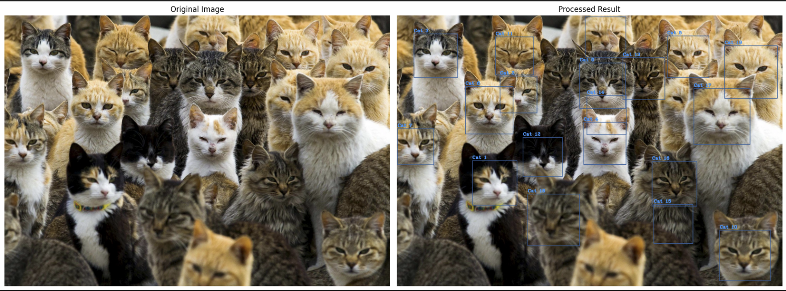

# Cat Detector

## Overview

The Cat Detector script automatically identifies cat faces in static images using OpenCV’s Haar Cascade classifier. It covers model loading, image preprocessing, multi-scale detection, annotation, and visualization, making it a concise reference for object detection tasks.

## Key Features

* `Haar Cascade Detection`: Employs `haarcascade_frontalcatface_extended.xml` to detect frontal cat faces with fine-grained scale adjustments.
* `Cross-Platform Path Handling`: Utilizes `os.path.join` to build file paths, ensuring compatibility across operating systems.
* `Visualization with Matplotlib`: Integrates Matplotlib for clear presentation of original and annotated images.
* `Configurable Parameters`: Allows tuning of detection sensitivity through `scaleFactor`, `minNeighbors`, and `minSize`.

## Requirements

* `Python`: 3.6 or higher
* `Libraries`:

  * `opencv-python` (4.x) for image I/O and detection
  * `matplotlib` (3.x) for plotting
* `Model File`:

  * Place `haarcascade_frontalcatface_extended.xml` in the `models/` directory

## Detailed Code Explanation

### 1. Imports & Configuration

```python
import cv2
import os
import matplotlib.pyplot as plt

# Define directories for inputs and model
DATA_DIR = "images"
MODEL_PATH = os.path.join("models", "haarcascade_frontalcatface_extended.xml")
```

* `cv2`: Core OpenCV module for reading images, performing detections, drawing shapes, and color space conversions.
* `os`: File path operations via `os.path.join`, ensuring code works on Windows, macOS, and Linux.
* `matplotlib.pyplot`: Used to display images inline, handle figure sizing, subplots, and remove axes for a clean view.
* `Constants`: `DATA_DIR` and `MODEL_PATH` centralize resource locations.

### 2. Loading & Displaying the Input Image

* `File Check`: Raises an exception if `cv2.imread` returns `None`, preventing silent failures.
* `Color Conversion`: Ensures displayed colors match human expectations (OpenCV reads BGR by default).
* `Plotting`: `figsize` controls image display size, `axis('off')` hides ticks and borders, `title()` adds context.

### 3. Defining the Detection Function

```python
def detect_cat_faces(img, model_path):
    classifier = cv2.CascadeClassifier(model_path)

    faces = classifier.detectMultiScale(
        img,
        scaleFactor=1.01,
        minNeighbors=2,
        minSize=(180, 180)
    )

    for idx, (x, y, w, h) in enumerate(faces):
        cv2.rectangle(img, (x, y), (x + w, y + h), (38, 94, 158), thickness=2)
        label = f"Cat {idx+1}"
        cv2.putText(
            img,
            label,
            (x, y - 10),
            cv2.FONT_HERSHEY_COMPLEX_SMALL,
            1.2,
            (0, 150, 255),
            thickness=2,
            lineType=cv2.LINE_AA
        )
    return img
```

* `CascadeClassifier`: Loads parameters and trained features from the XML file.
* `detectMultiScale Parameters`:

  * `scaleFactor=1.01`: Zooms in slowly, allowing detection of faces at nearly every size.
  * `minNeighbors=2`: Accepts regions with at least two overlapping detections, reducing noise.
  * `minSize=(180,180)`: Ignores detections smaller than 180×180 pixels to filter out non-face patterns.
* `Annotation`:

  * `cv2.rectangle`: Draws a colored bounding box; color chosen for contrast.
  * `cv2.putText`: Renders text with anti-aliasing for clarity.
  * Labels are dynamically numbered to distinguish multiple detections.

### 4. Running Detection & Visualizing Results

* `Image Copy`: Avoids altering the original data when drawing annotations.
* `Subplots`: `subplot(1,2,i)` splits the figure into two panels; titles clarify content.
* `Layout Management`: `tight_layout()` prevents overlapping titles and axes.

### 5. Extending to Multiple Images or Streams

* `Handling Multiple Files`: Loop over filenames in `DATA_DIR`, apply `detect_cat_faces()`, and save or display each result.
* `Real-Time Video Adaptation`: Replace `cv2.imread` with `cv2.VideoCapture` loops, process each frame, show with `cv2.imshow`, and handle exit via `cv2.waitKey()`.


## Results

The results of this test are shown bellow:

<div style="display: flex; justify-content: center;">
<div align="center" style= "margin: 10px;">
    
</div>
</div>
